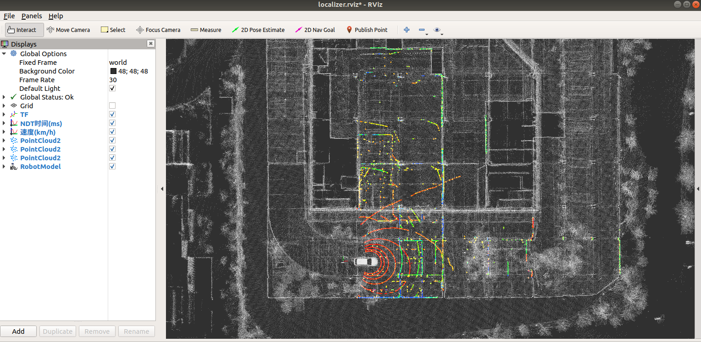

# NDT Localizer




> To run this project, you need the point cloud map.  
> Here is a project [ROS_NDT_Mapping](https://github.com/leofansq/ROS_NDT_Mapping) for the map generation :)

## Environment
* Ubuntu 18.04
* ROS Melodic

## Data
* Point Cloud Map (.pcd format)
* RosBag for offline testing

## IO
- input  
/points_raw (sensor_msgs::PointCloud2)   
/ndt_map (sensor_msgs::PointCloud2) 
- output  
/ndt_pose (geometry_msgs::PoseStamped)  
/odom (nav_msgs::Odometry)  
  > we generate a pseudo odom based on the movement.

## How to use
* Move the project into the ROS workspace (e.g. ~/ros_ws/src/)
* Build the project in the ROS workspace
  ```bash
  cd ros_ws/
  catkin_make
  ```
* Setup the configuration
  * Map Path: Move the map file (.pcd) into the [map folder](./map/), and setup the pcd_path in [map_loader.launch](./launch/map_loader.launch).
    ```xml
    <!-- line 16 -->
    <arg name="pcd_path"  default="$(find ndt_localizer)/map/map.pcd"/> 
    ```

  * Downsample Rate: Setup the downsample rate in [points_downsample.launch](./launch/points_downsample.launch).
    ```xml
    <!-- line 6 -->
    <arg name="leaf_size" default="1.0" />
    ```
    > Note: For the sparse LIDAR data (e.g. VLP-16), the recommend downsample rate is 1.0, while that for the dense LIDAR data (e.g. OUSTER-64) is 2.5.

  * Static TF: Setup the static transformation `base_link_to_localizer` and `world_to_map` in [static_tf.launch](./launch/static_tf.launch).
    ```xml
    <node pkg="tf2_ros" type="static_transform_publisher" name="localizer_to_base_link" args="0 0 0 0 0 0 base_link velodyne"/>
    <node pkg="tf2_ros" type="static_transform_publisher" name="world_to_map" args="0 0 0 0 0 0 map world" />
    ```
  * NDT Parameters: Setup the parameters in [ndt_localizer.launch](./launch/ndt_localizer.launch)
    ```xml
    <!-- line 20-24  -->
    <arg name="trans_epsilon" default="0.05" doc="The maximum difference between two consecutive transformations in order to consider convergence" />
    <arg name="step_size" default="0.1" doc="The Newton line search maximum step length" />
    <arg name="resolution" default="2.0" doc="The ND voxel grid resolution" />
    <arg name="max_iterations" default="30.0" doc="The number of iterations required to calculate alignment" />
    <arg name="converged_param_transform_probability" default="3.0" doc="The converged_param_transform_probability" />
    ```
    > Note: The default parameters work well with 16 LIDAR.
  
* Run the NDT-Localizer
  * Source the setup.bash
    ```bash
    cd ros_ws
    source devel/setup.bash
    ```
  
  * Launch the NDT-Localizer node
    ```bash
    roslaunch ndt_localizer ndt_localizer.launch
    ```
    > Note: The loading of the map may takes few seconds, please wait until the point cloud map is ready.

  
* Pose Initialization (Optional): You can give an initial pose with the 2D Pose Estimate (green arrow) in the RVIZ. The initial pose will be published to the topic `/initialpose`.

* Play the rosbag for offline testing
  ```bash
  rosbag play offline_testing.bag
  ```

* Subscribe the localization messages from the topic `/ndt_pose`.
  ```xml
  <!--  Demo  -->
  ---
  header: 
    seq: 1867
    stamp: 
      secs: 1566536121
      nsecs: 251423898
    frame_id: "map"
  pose: 
    position: 
      x: -94.8022766113
      y: 544.097351074
      z: 42.5747337341
    orientation: 
      x: 0.0243843578881
      y: 0.0533175268768
      z: -0.702325920272
      w: 0.709437048124
  ---
  ```

## Acknowledgment

Part of the code refers to the open-sourced project [Autoware](https://github.com/Autoware-AI/autoware.ai)

## Related projects in pure ROS (Melodic) 

* [ROS_NDT_Mapping](https://github.com/leofansq/ROS_NDT_Mapping)
* [ROS_Waypoints_Processor](https://github.com/leofansq/ROS_Waypoints_Processor)
* [ROS_Pure_Pursuit](https://github.com/leofansq/ROS_Pure_Pursuit)
* [ROS_Object_Cluster](https://github.com/leofansq/ROS_Object_Cluster)
